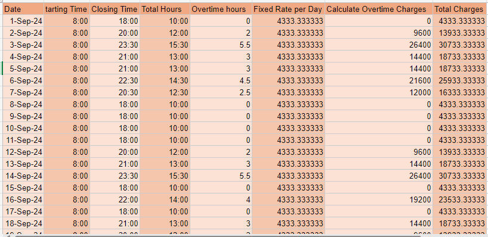

# Machinery Bill Calculator

This project is an Excel-based machinery bill calculator that helps manage fixed rates, overtime charges, and generates a monthly bill report.

## Features
- Automatic calculation of overtime hours and charges.
- Generates total monthly charges based on the data provided in the daily logs.
- Two Excel sheets: one for data input, another for automatic billing.

## Screenshots

### 1. Data Table
This sheet stores daily machinery usage data such as start time, end time, and overtime hours.

### 2. Monthly Bill Calculator
This sheet calculates the total monthly charges based on the input data, including fixed rate and overtime charges.

## How to Use
1. Download both Excel sheets: `machinery_log_data.xlsx` and `monthly_bill_calculator.xlsx`.
2. Fill in the data table with machinery usage information.
3. View the automatically generated bill in the monthly bill calculator sheet.

